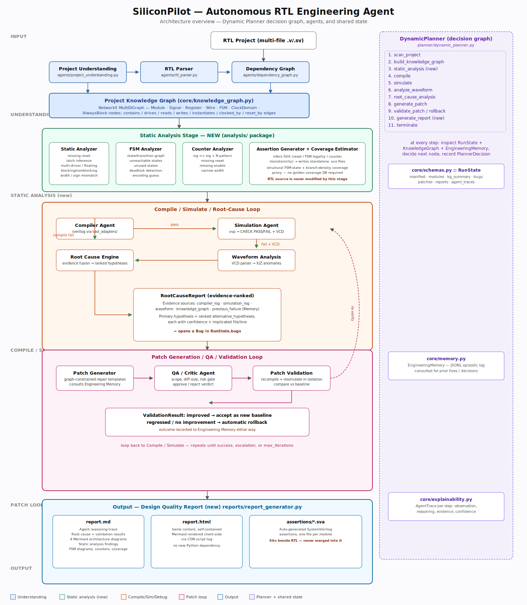

# SiliconPilot — Reference Implementation



A working, runnable Phase-1 slice of the SiliconPilot autonomous-AI-hardware-engineer
architecture: it reads an RTL project, compiles it, simulates it, parses the waveform,
localizes a root cause, generates and QA-reviews a patch, applies it, and re-verifies —
looping until the design passes or a stopping condition is hit. No mocked output: every
step in the demo actually invokes Icarus Verilog and parses real compiler/simulator/VCD
output.

This is the **Phase-1 MVP slice** of the full system described in the accompanying
system design document (agents: Project Understanding, RTL Parser, Dependency Graph,
Compiler, Simulation, Waveform Analysis, Root Cause Analysis, Patch Generation, QA/Critic,
Planner). Coverage/Assertion/Timing/Power/Area/CDC/Lint/Documentation/Memory agents,
Neo4j, LangGraph, and the FastAPI service are stubbed or described as extension points —
see "What's real vs. what's a stub" below.

## Quickstart

```bash
# System dependency (Ubuntu/Debian):
apt-get install -y iverilog

# Python dependencies:
pip install pydantic networkx --break-system-packages

# Run the full autonomous loop on a seeded-bug project:
python3 run_demo.py
```

Expected output: SiliconPilot detects a compiling-but-functionally-broken accumulator
module (a register with no reset, causing X-propagation), localizes the root cause from
compiler+waveform evidence, generates a minimal patch, gets it approved by the QA agent,
applies it, and re-verifies — ending in `status: success` after 2 iterations.

## What's real vs. what's a stub

| Component | Status |
|---|---|
| Project Understanding Agent | **Real** — walks filesystem, classifies RTL/TB files |
| RTL Parser Agent | **Real** — regex/state-machine structural parser (module/port/register/instance extraction). Swap for Tree-sitter's Verilog grammar in production. |
| Dependency Graph Agent | **Real** — NetworkX instantiation graph + blast-radius query |
| Compiler Agent | **Real** — actually shells out to `iverilog`, parses real diagnostics |
| Simulation Agent | **Real** — actually shells out to `vvp`, parses real `$display` output |
| Waveform Analysis Agent | **Real** — hand-rolled VCD parser (zero deps), detects X-propagation from the real `dump.vcd` |
| Root Cause Analysis Agent | **Real deterministic fusion** of compiler+waveform evidence. The LLM-based reasoning step described in the design doc is a clearly marked extension point (`agents/waveform_rootcause.py`) so you can swap in a Claude API call with zero other changes. |
| Patch Generation Agent | **Real, but template-based** — pattern-matches "register updated with no reset branch" and synthesizes a real unified diff. Also has a clearly marked extension point for an LLM-based diff generator. |
| QA/Critic Agent | **Real rule engine** — scope check, non-trivial-diff check, risk gate |
| Planner | **Real** explicit Python state machine implementing the design doc's engineering loop and stopping conditions. Written so porting to `langgraph.graph.StateGraph` is a mechanical 1:1 transformation. |
| Coverage / Assertion / Timing / Power / Area / CDC / Lint / Documentation / Memory agents | **Described, not implemented** — see the system design doc for their contracts; Phase 1 intentionally scopes to functional-bug-fixing only |
| Neo4j / Postgres / Redis / FastAPI / LangGraph | **Not wired up** — this reference repo uses in-memory Pydantic models + NetworkX so it runs with zero infra. `core/schemas.py` is the same schema set the design doc's Postgres tables and Neo4j nodes are based on, so persistence is a mechanical next step. |

## Upgrade: from bug-fixer to miniature RTL engineer

On top of the Phase-1 loop above, SiliconPilot now runs a **Static RTL Analysis +
FSM/Counter/Assertion/Coverage** pass (planner node `static_analysis`, right after the
Knowledge Graph is built and *before* the first compile attempt) and produces a
standalone **Design Quality Report** (planner node `generate_report`, always the last
node before `terminate`) on every run, success or failure. These are pure additions —
nothing about the original compile → simulate → root-cause → patch → validate loop
changed, and both `run_demo.py --legacy` (fixed pipeline) and the default Dynamic
Planner path still work unmodified.

### New capabilities

| Capability | Module | What it does |
|---|---|---|
| Static RTL Analysis | `analysis/static_analyzer.py` | Missing reset, latch inference (`if` w/o `else`, `case` w/o `default`), unused signals, blocking-in-sequential / nonblocking-in-combinational misuse, multiple drivers, floating wires, constant-tied outputs, signed/unsigned mixing, width-mismatched literal assignments |
| FSM Analyzer | `analysis/fsm_analyzer.py` | Recovers state lists + transition graph from `case(state)` bodies the Knowledge Graph already flagged as FSMs; flags unreachable states, declared-but-unused states, and deadlock states (no escape transition); emits a Mermaid state diagram per FSM |
| Counter Analyzer | `analysis/counter_analyzer.py` | Detects `sig <= sig + N` patterns; flags missing reset, missing enable/qualifying condition, suspiciously narrow width, non-literal increment steps |
| Assertion Generator | `analysis/assertion_generator.py` | Infers SVA properties (reset behavior, FSM legality, counter monotonicity) from the Knowledge Graph / FSM / Counter reports and writes them to standalone `<module>_assertions.sva` files under `work_dir/assertions/` — **RTL source is never modified** |
| Coverage Estimator | `analysis/coverage_estimator.py` | Structural coverage proxy (no golden coverage DB required): FSM state reachability minus unreachable/unused states, and a branch-density-vs-waveform-activity estimate, both with concrete "here's what's undertested" notes |
| Design Quality Report | `reports/report_generator.py` | Wraps the existing explainability report (agent traces + module hierarchy / dependency / agent-workflow / planner-state-machine Mermaid diagrams) and appends the five sections above; writes both `report.md` and a self-contained `report.html` (Mermaid rendered client-side via CDN — no new Python dependency) |
| Robust error handling | `tool_adapters/icarus_adapter.py` | Missing `iverilog`/`vvp` binaries and simulation timeouts now degrade to a typed `CompileReport`/`SimResult` with a clear diagnostic instead of crashing the planner — static analysis, FSM/counter/assertion/coverage, and the report still run even with no simulator installed |

All five new analyzers plug into the **same** `DynamicPlanner` decision graph as
first-class nodes (`static_analysis`, `generate_report`) rather than standalone
scripts, per the "everything integrates into the planner" design constraint — see
`planner/dynamic_planner.py::_run_static_analysis` / `_run_generate_report` and the
`PlannerNodeName` transitions in `core/schemas.py`.

### Design improvements

- **Single source of truth for FSM/reset facts.** `fsm_analyzer` and the "missing
  reset" static check both read from `ProjectKnowledgeGraph` (which already parses
  always-block sensitivity lists and case-statement state signals) instead of
  re-deriving the same facts with a second regex pass — avoids the two analyses ever
  disagreeing.
- **Additive, non-blocking analysis.** None of the five new analyzers can fail the
  planner loop: each is wrapped in its own `AgentTrace` with an honest confidence
  score, and a missing simulator (or zero findings) degrades gracefully rather than
  raising.
- **RTL is never touched by anything except the existing, QA-reviewed Patch
  Generator.** Assertions are written to sibling `.sva` files; static/FSM/counter
  findings are report-only.
- **Typed schemas throughout.** Every new capability gets its own Pydantic model
  (`StaticFinding`/`StaticAnalysisReport`, `FSMInfo`/`FSMTransition`/
  `FSMAnalysisReport`, `CounterInfo`/`CounterAnalysisReport`,
  `GeneratedAssertion`/`AssertionSuite`, `CoverageEstimate`) threaded through
  `RunState`, matching the existing convention in `core/schemas.py` — no ad-hoc dicts.
- **Zero new dependencies.** Reuses the existing `pydantic`/`networkx` stack; Mermaid
  (already used for the four original diagrams) is reused for FSM diagrams, and the
  HTML report uses a small hand-rolled Markdown→HTML fragment renderer instead of
  pulling in `markdown`/`jinja2`.

## Project layout

```
siliconpilot/
├── core/schemas.py           # every typed message/payload used by every agent
├── tool_adapters/
│   ├── icarus_adapter.py     # real iverilog/vvp subprocess wrapper (now degrades gracefully if missing)
│   └── vcd_adapter.py        # dependency-free VCD parser
├── agents/
│   ├── project_understanding.py
│   ├── rtl_parser.py
│   ├── dependency_graph.py
│   ├── compiler_sim.py
│   ├── waveform_rootcause.py
│   └── patch_qa.py
├── analysis/                 # NEW: static/FSM/counter/assertion/coverage analyzers
│   ├── static_analyzer.py
│   ├── fsm_analyzer.py
│   ├── counter_analyzer.py
│   ├── assertion_generator.py
│   └── coverage_estimator.py
├── reports/
│   └── report_generator.py   # NEW: Design Quality Report (Markdown + HTML)
├── planner/
│   ├── planner.py            # original fixed pipeline (untouched, still works via --legacy)
│   └── dynamic_planner.py    # decision-graph planner; now includes static_analysis + generate_report nodes
├── demo_project/             # seeded-bug RTL project used by run_demo.py
│   ├── rtl/accumulator.v     # has a real missing-reset bug
│   └── tb/tb_accumulator.v
├── runs/                     # sandbox copies + tool working dirs land here
│   └── demo_run/work/
│       ├── report.md / report.html   # Design Quality Report
│       └── assertions/*.sva          # generated SVA assertion files
└── run_demo.py                # entry point
```

## Extending this into the full system

1. **Swap in an LLM for root-cause/patch-gen.** Both extension points are marked with
   `# --- Extension point ---` comments. The key design constraint to preserve: the LLM
   call receives the structured `WaveformFindings`/`CompileReport` objects (never raw
   stdout/VCD text), and its output must be forced into the `RootCauseHypothesis` /
   `PatchProposal` schemas (e.g. via Claude's structured output / tool-use).
2. **Add Verilator as a second compiler backend** (`tool_adapters/verilator_adapter.py`)
   for larger/synthesizable-subset projects and richer lint (`--lint-only`).
3. **Add Yosys+OpenSTA adapters** for the Timing/Power/Area agents described in the
   design doc, following the same `run(config) -> StructuredResult` adapter pattern.
4. **Persist `RunState` to Postgres** using the schema in the design doc §10, and mirror
   `DependencyGraphSummary` into Neo4j per §6 — `core/schemas.py` already matches those
   shapes.
5. **Port `planner/planner.py` to LangGraph** — each function in that file is already a
   `(RunState) -> RunState` node; wrap with `StateGraph.add_node`/`add_edge` per the
   state diagram in the design doc §7.
6. **Wrap in FastAPI** per the design doc §9 endpoint list to get the run dashboard/API.

See `SiliconPilot_System_Design.md` for the full architecture this scaffold implements.
