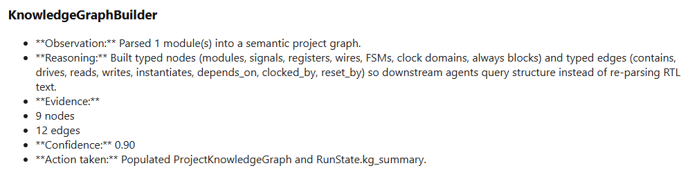
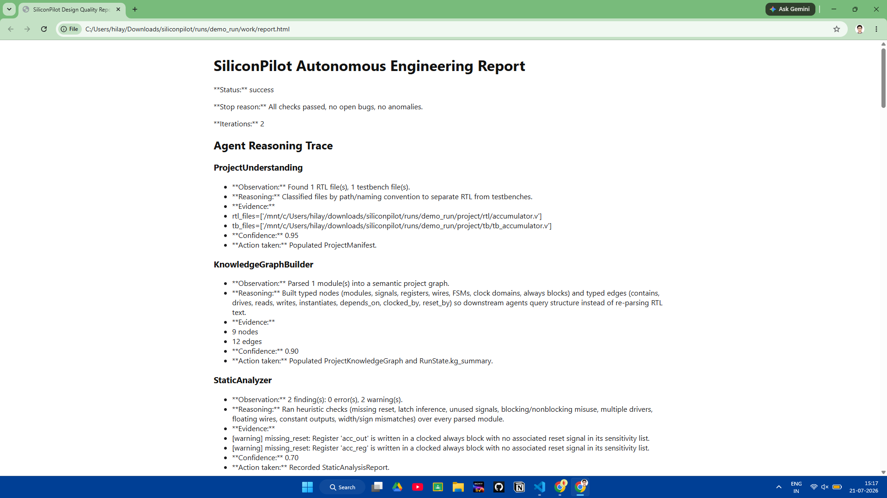
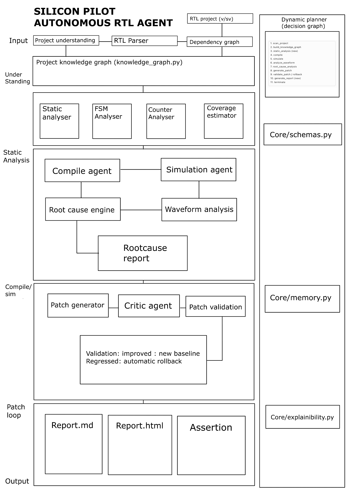

<div align="center">

# SiliconPilot
### Autonomous RTL Engineering Agent for Hardware Design Verification, Debugging and Self-Healing


---

**SiliconPilot** is an autonomous AI-powered RTL engineering framework capable of understanding Verilog projects, compiling designs, executing simulations, analyzing waveforms, identifying root causes of failures, generating fixes, validating patches, and producing explainable engineering reports—all without manual intervention.

</div>

---

# Overview

Modern RTL verification requires engineers to repeatedly compile, simulate, inspect waveforms, debug failures, edit RTL, rerun simulations, and verify fixes.

SiliconPilot automates this engineering loop.

Instead of functioning as a traditional script, SiliconPilot behaves as an autonomous engineering agent that continuously reasons about the current state of a hardware project and determines the next engineering action.

The framework combines:

- Static RTL analysis
- Dynamic simulation
- Waveform inspection
- Knowledge graph reasoning
- Root cause localization
- Automated RTL patch generation
- Patch validation
- Explainable report generation

---

# Demo

<p align="center">

</p>

Example autonomous execution:

```
Scan Project
      ↓
Build Knowledge Graph
      ↓
Static Analysis
      ↓
Compile RTL
      ↓
Run Simulation
      ↓
Simulation Failed
      ↓
Analyze Waveform
      ↓
Root Cause Analysis
      ↓
Generate RTL Patch
      ↓
Validate Patch
      ↓
Recompile
      ↓
Resimulate
      ↓
PASS
      ↓
Generate Engineering Report
```

---

# Features

## Autonomous Engineering Loop

- Automatic project understanding
- Intelligent planning
- Dynamic workflow execution
- No manually scripted debug sequence

---

## RTL Parsing

Supports Verilog designs including:

- Modules
- Registers
- Wires
- FSM extraction
- Counter detection
- Signal dependency graph

---

## Static Analysis

Detects:

- Uninitialized registers
- Multiple drivers
- Dead logic
- Unreachable code
- Missing reset logic
- Potential latch inference
- Counter structures
- FSM structures

---

## Knowledge Graph

SiliconPilot builds a hardware knowledge graph representing

- Modules
- Signals
- Registers
- Connections
- Dependencies
- Drivers
- Readers

Example:

<p align="center">

</p>

---

## Automatic Compilation

Supports

- Icarus Verilog

Compilation is automatically triggered whenever RTL changes.

---

## Automatic Simulation

Runs the supplied testbench.

Collects

- Console logs
- Exit status
- Assertions
- Generated VCD waveform

---

## Waveform Analysis

Automatically inspects VCD files to identify

- X propagation
- Unknown values
- Signal glitches
- Incorrect outputs
- Register initialization issues

---

## Root Cause Engine

Rather than simply reporting failures, SiliconPilot attempts to identify the actual bug.

Example

```
Signal:
tb_accumulator.dut.acc_reg

Issue:
Register powers up as X

Cause:
Clocked register has no reset

Confidence:
0.85
```

---

## Automatic Patch Generation

Generates RTL fixes such as

- Reset insertion
- Missing conditions
- Register initialization
- FSM corrections
- Logic replacement

Example generated patch

```verilog
always @(posedge clk or posedge rst) begin
    if (rst)
        acc_reg <= 0;
    else if (en)
        acc_reg <= acc_reg + data_in;
end
```

---

## Patch Validation

Every generated fix is automatically

- Recompiled
- Resimulated
- Compared against previous results

Only validated patches are accepted.

---

## Explainable Reports

SiliconPilot generates

- Markdown reports
- HTML reports
- Architecture diagrams
- Bug summaries
- Patch explanations

Example

<p align="center">

</p>

---

# Project Architecture

<p align="center">

</p>

---

# Repository Structure

```
SiliconPilot/
│
├── agents/
│
├── analysis/
│
├── api/
│
├── core/
│
├── planner/
│
├── reports/
│
├── tool_adapters/
│
├── demo_project/
│
├── docs/
│
├── memory_store/
│
├── images/
│
├── requirements.txt
├── run_demo.py
├── README.md
└── SYSTEM_DESIGN.md
```

---

# Installation

Clone the repository

```bash
git clone https://github.com/hilay020905/siliconpilot.git

cd siliconpilot
```

Install dependencies

```bash
pip install -r requirements.txt
```

Dependencies include

- pydantic
- networkx
- Icarus Verilog

---

# Running

Execute

```bash
python run_demo.py --verbose
```

Expected output

```
Planner executing node: scan_project

Planner executing node: build_knowledge_graph

Planner executing node: static_analysis

Compile PASS

Simulation FAIL

Waveform Analysis

Root Cause Analysis

Patch Generated

Patch Validated

Simulation PASS

Engineering Report Generated
```

---

# Example Output

```
Status:
SUCCESS

Iterations:
2

Bugs Found:
1

Patch Applied:
YES

Simulation:
PASS

Engineering Report:
Generated
```

---

# Example Bug Fixed

Original RTL

```verilog
always @(posedge clk) begin
    if(en)
        acc_reg <= acc_reg + data_in;
end
```

Generated Fix

```verilog
always @(posedge clk or posedge rst) begin
    if(rst)
        acc_reg <= 0;
    else if(en)
        acc_reg <= acc_reg + data_in;
end
```

Result

✅ Simulation passes

---

# Future Roadmap

- Multi-file RTL projects
- SystemVerilog support
- Formal verification
- Assertion synthesis
- Coverage-driven debugging
- Incremental compilation
- ML-based bug ranking
- LLM-assisted RTL repair
- OpenROAD integration
- Yosys integration
- Verilator backend
- Vivado backend
- FPGA synthesis support
- CI/CD integration

---

# Technologies Used

- Python
- Verilog
- Icarus Verilog
- NetworkX
- Pydantic

---

# Author

**Hilay Patel**

Indian Institute of Technology Tirupati

GitHub:
https://github.com/hilay020905


<div align="center">

### ⭐ If you found SiliconPilot useful, please consider giving the repository a star!

</div>
