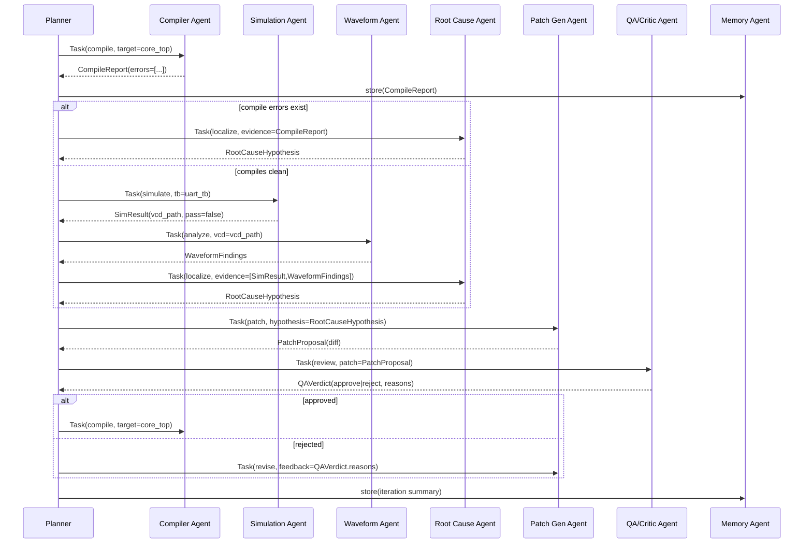
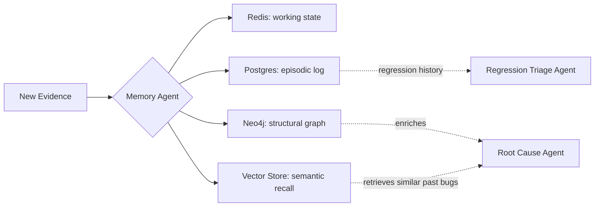
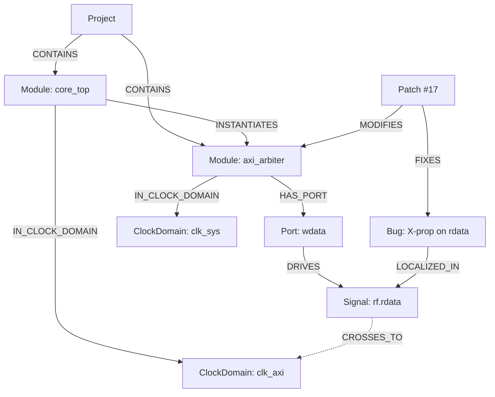
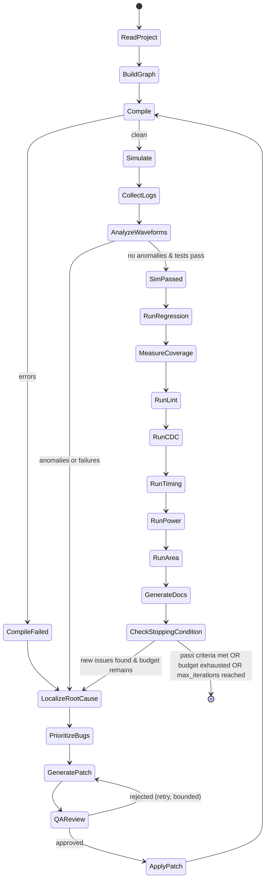
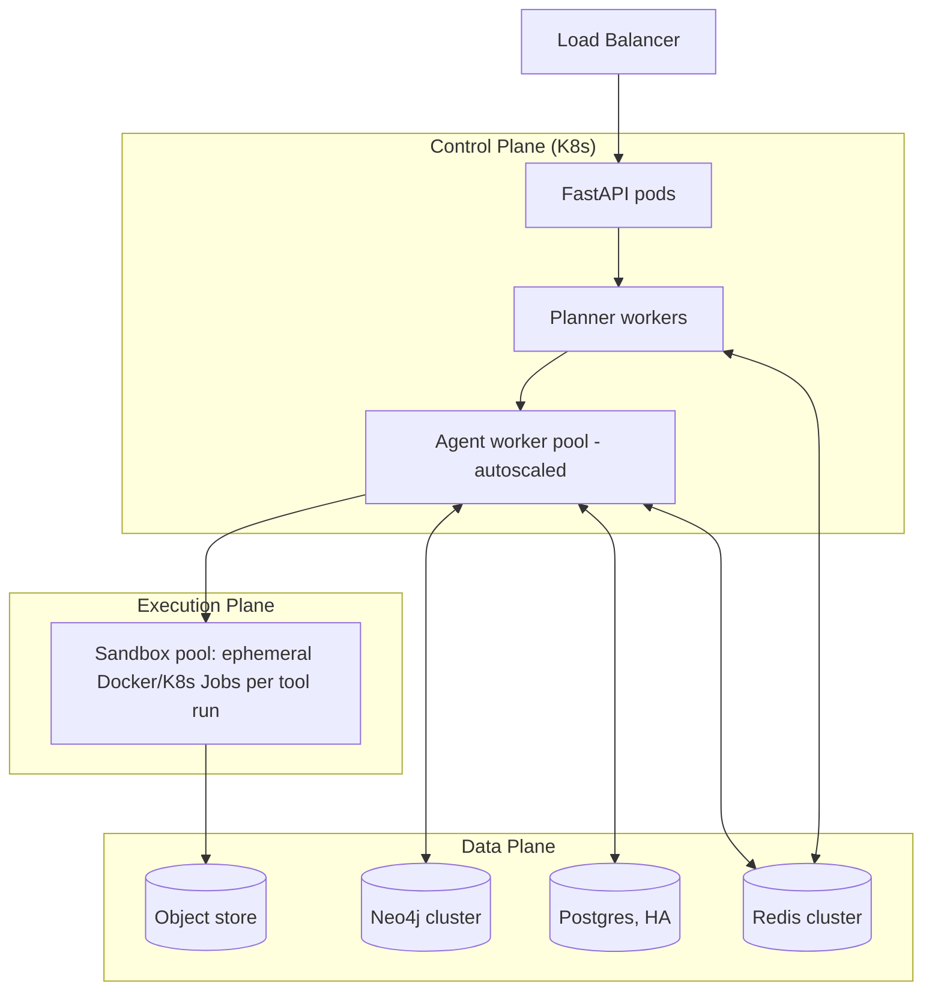

# SiliconPilot — Autonomous AI Hardware Engineer
## System Design Document v1.0

---

## 0. Executive Summary

SiliconPilot is a multi-agent, tool-using autonomous system that operates on real RTL repositories the way a senior verification/design engineer would: it reads the project, builds a structural understanding of it, compiles and simulates it, reads the resulting logs and waveforms, localizes root causes, writes patches, re-runs regression, and iterates until the design passes verification or a stopping condition is hit — while maintaining a persistent engineering memory and producing human-readable documentation and reports at every step.

It is not a code-completion tool or a RAG-over-docs chatbot. Its core loop is a **closed control loop over EDA tool executions**, not a single-shot text generation. The LLM's job in this system is confined to three things: (1) planning/tool-selection, (2) structured reasoning over parsed tool output (never raw text blobs), and (3) code/patch synthesis constrained by the project's own graph and coding conventions. Everything else — parsing, graph-building, waveform decoding, coverage math — is done by deterministic tools, because EDA correctness cannot tolerate LLM hallucination in the loop.

---

## 1. Overall Architecture

```mermaid
graph TB
    subgraph "Interface Layer"
        UI[Web UI / IDE Extension]
        CLI[CLI]
        API[REST/WebSocket API]
    end

    subgraph "Orchestration Layer"
        PLN[Planner Agent - LangGraph State Machine]
        ORCH[Agent Orchestrator / Router]
        MEM[Memory Agent]
    end

    subgraph "Understanding Agents"
        PUA[Project Understanding Agent]
        RPA[RTL Parser Agent]
        AUA[Architecture Understanding Agent]
        DGA[Dependency Graph Agent]
    end

    subgraph "Execution Agents"
        COMP[Compiler Agent]
        SIM[Simulation Agent]
        WFA[Waveform Analysis Agent]
        RCA[Root Cause Analysis Agent]
        BPA[Bug Prioritization Agent]
        PGA[Patch Generation Agent]
    end

    subgraph "Verification & QoR Agents"
        VER[Verification Agent]
        COV[Coverage Agent]
        ASG[Assertion Generation Agent]
        TIM[Timing Analysis Agent]
        PWR[Power Optimization Agent]
        ARE[Area Optimization Agent]
        CDC[CDC Analysis Agent]
        LNT[Lint Analysis Agent]
    end

    subgraph "Meta Agents"
        DOC[Documentation Agent]
        QA[Quality Assurance / Critic Agent]
        SEC[Security & Sandbox Agent]
        COST[Cost/Resource Governor Agent]
    end

    subgraph "Tool Execution Layer (Sandboxed Workers)"
        T1[Verilator/Icarus/VCS/Questa]
        T2[GTKWave/VCD parsers]
        T3[Yosys/OpenROAD/OpenSTA]
        T4[SymbiYosys]
        T5[FuseSoC/Vivado/Quartus]
        T6[Git/GitHub]
    end

    subgraph "Knowledge & State Layer"
        KG[(Neo4j Knowledge Graph)]
        PG[(PostgreSQL - runs, patches, metrics)]
        RD[(Redis - queues, ephemeral state)]
        VS[(Vector Store - embeddings for retrieval)]
        FS[(Artifact/Object Store - logs, VCDs, reports)]
    end

    UI --> API
    CLI --> API
    API --> ORCH
    ORCH --> PLN
    PLN --> PUA & RPA & AUA & DGA
    PLN --> COMP & SIM & WFA & RCA & BPA & PGA
    PLN --> VER & COV & ASG & TIM & PWR & ARE & CDC & LNT
    PLN --> DOC & QA & SEC & COST
    PLN <--> MEM
    MEM <--> KG
    MEM <--> PG
    MEM <--> VS

    COMP & SIM & WFA & TIM & PWR & ARE & CDC & LNT --> SEC
    SEC --> T1 & T2 & T3 & T4 & T5 & T6
    T1 & T2 & T3 & T4 & T5 & T6 --> FS
    FS --> WFA & RCA & COV & TIM

    PLN --> RD
```



**Design principle:** every agent is a stateless function over (KnowledgeGraph state, Memory context, Task) → (Action, Structured Output). Agents never talk to each other directly in free text; they communicate through the Planner via typed messages and through shared state in Postgres/Neo4j. This makes the system debuggable, replayable, and auditable — essential for an engineering tool that will touch production RTL.

---

## 2. Agent Responsibilities

| # | Agent | Responsibility | Primary Tools | Output Artifact |
|---|-------|-----------------|----------------|------------------|
| 1 | Planner | Owns the engineering loop (LangGraph graph), decides next action, tracks stopping conditions, budget | LangGraph, Redis | `PlanStep`, `RunTrace` |
| 2 | Project Understanding | Scans repo, detects toolchain, testbench structure, build system (FuseSoC/Makefile), languages used | Tree-sitter, filesystem walk | `ProjectManifest` |
| 3 | RTL Parser | Parses Verilog/SV into ASTs, extracts modules/ports/params/instances | Tree-sitter (verilog grammar), Slang/Verible | `ModuleAST[]` |
| 4 | Architecture Understanding | Classifies structural patterns: FSMs, pipelines, AXI/UART/SPI/I2C interfaces, caches, RISC-V core structures, hazard/forwarding logic | Graph pattern-matching over AST + KG, LLM-assisted labeling | `ArchitectureModel` |
| 5 | Dependency Graph | Builds module instantiation graph, clock/reset domain graph, signal fan-in/fan-out graph | NetworkX + Neo4j | `DependencyGraph` |
| 6 | Compiler | Invokes Verilator/Icarus/VCS/Questa, parses structured diagnostics | Verilator, Icarus, VCS/Questa | `CompileReport` |
| 7 | Simulation | Runs testbenches, manages seeds/stimulus, collects VCD/FST | Verilator, Icarus, VCS | `SimResult`, `VCD` |
| 8 | Waveform Analysis | Parses VCD/FST, extracts signal transitions, aligns to RTL semantics, detects glitches/X-propagation | pyvcd/pylibfst, GTKWave scripting | `WaveformFindings` |
| 9 | Root Cause Analysis | Fuses compiler errors + waveform anomalies + AST + KG to localize a minimal causal signal/line | LLM reasoning over structured evidence + KG traversal | `RootCauseHypothesis[]` |
| 10 | Bug Prioritization | Ranks open issues by severity, blast radius (via dependency graph), confidence | Heuristics + KG centrality | `PrioritizedBugQueue` |
| 11 | Patch Generation | Synthesizes minimal RTL diff constrained to implicated module(s)/signal(s) | LLM (constrained decoding to diff format) + AST validity check | `PatchProposal` (unified diff) |
| 12 | Verification | Re-runs regression after patch, tracks pass/fail deltas, formal checks via SymbiYosys | Verilator/VCS, SymbiYosys | `VerificationReport` |
| 13 | Coverage | Collects/aggregates line/toggle/FSM/functional coverage, identifies coverage holes | Verilator coverage, VCS URG, custom | `CoverageReport` |
| 14 | Assertion Generation | Proposes SVA assertions from architecture model + observed bugs | LLM + templates, checked via SymbiYosys | `AssertionSet` |
| 15 | Timing Analysis | Runs STA, extracts critical paths, slack, suggests retiming/pipelining | OpenSTA | `TimingReport` |
| 16 | Power Optimization | Estimates/analyzes switching activity & power, suggests clock gating / operand isolation | Yosys + OpenROAD power estimation | `PowerReport` |
| 17 | Area Optimization | Analyzes synthesis area breakdown, suggests resource sharing | Yosys, OpenROAD | `AreaReport` |
| 18 | CDC Analysis | Detects unsynchronized clock-domain crossings, missing synchronizers | Custom CDC checker over KG + Yosys | `CDCReport` |
| 19 | Lint Analysis | Style/semantic lint (latches, blocking/non-blocking misuse, unused signals) | Verilator `--lint-only`, Verible lint | `LintReport` |
| 20 | Documentation | Generates module docs, architecture diagrams (Mermaid), sequence diagrams, bug reports | LLM + templating | `.md`/diagrams |
| 21 | Memory | Maintains long-term project memory: prior bugs, decisions, prior patches, user preferences | Neo4j + Postgres + vector store | Memory entries |
| 22 | Quality Assurance (Critic) | Reviews every patch/report before it's accepted; checks for regressions, style violations, unjustified claims | Rule engine + LLM critic pass | `QAVerdict` |
| 23 | **Security & Sandbox Agent** *(new)* | Executes all tool calls inside isolated containers, enforces resource/time limits, blocks unsafe shell patterns | Docker, seccomp | Sandboxed exec result |
| 24 | **Cost/Resource Governor** *(new)* | Tracks token spend, compute time, tool-run count; enforces budget & loop-count stopping conditions | Redis counters | `BudgetStatus` |
| 25 | **Regression Triage Agent** *(new)* | Distinguishes new failures from pre-existing/flaky failures across runs, prevents "fixing" already-passing tests | Postgres run history diff | `RegressionDelta` |
| 26 | **Synthesis/PPA Reconciliation Agent** *(new)* | Reconciles conflicting recommendations from Timing/Power/Area agents into one Pareto-aware recommendation | Multi-objective heuristic | `PPADecision` |

---

## 3. Agent Communication

All inter-agent communication is **typed, structured, and mediated by the Planner** — no agent calls another agent directly. This avoids the "agent telephone game" failure mode and keeps every hop auditable.



### Message envelope (every message on the bus uses this shape)

```json
{
  "msg_id": "uuid",
  "trace_id": "run-uuid (ties to a full engineering-loop run)",
  "parent_msg_id": "uuid|null",
  "from": "planner",
  "to": "compiler_agent",
  "type": "task | result | error | escalation",
  "task_type": "compile | simulate | analyze_waveform | localize_root_cause | generate_patch | ...",
  "payload": { "...": "schema depends on task_type, see §4" },
  "budget": { "tokens_used": 0, "tool_seconds_used": 0 },
  "created_at": "ISO8601"
}
```

---

## 4. Message / Payload Schemas (representative)

```json
// CompileReport
{
  "success": false,
  "tool": "verilator",
  "duration_ms": 4210,
  "diagnostics": [
    {
      "severity": "error",
      "code": "WIDTHTRUNC",
      "file": "rtl/axi_arbiter.sv",
      "line": 142,
      "column": 9,
      "message": "Operator ASSIGNW expects 32 bits...",
      "raw": "...."
    }
  ]
}

// WaveformFindings
{
  "vcd_path": "runs/1234/dump.vcd",
  "window_ns": [1000, 1500],
  "anomalies": [
    {
      "type": "x_propagation",
      "signal": "top.core.rf.rdata",
      "first_seen_ns": 1220,
      "candidate_causes": ["uninitialized_reg", "missing_reset_path"]
    },
    {
      "type": "unexpected_glitch",
      "signal": "top.axi_if.wvalid",
      "time_ns": 1305
    }
  ]
}

// RootCauseHypothesis
{
  "hypothesis_id": "uuid",
  "confidence": 0.78,
  "summary": "wdata register in axi_arbiter is not reset, causing X on first write",
  "implicated_signals": ["top.core.rf.rdata"],
  "implicated_files": [{ "file": "rtl/axi_arbiter.sv", "lines": [88, 95] }],
  "evidence_refs": ["CompileReport#diag0", "WaveformFindings#anomaly0"],
  "supporting_graph_path": ["axi_arbiter.wdata_reg", "-> drives ->", "rf.rdata"]
}

// PatchProposal
{
  "patch_id": "uuid",
  "target_files": ["rtl/axi_arbiter.sv"],
  "diff": "--- a/rtl/axi_arbiter.sv\n+++ b/rtl/axi_arbiter.sv\n@@ ...",
  "rationale": "Add synchronous reset to wdata_reg to eliminate X-propagation on cold start.",
  "risk_level": "low",
  "expected_effect": ["fixes CompileReport#diag0", "resolves WaveformFindings#anomaly0"]
}

// QAVerdict
{
  "verdict": "reject",
  "reasons": [
    "Patch changes reset polarity, inconsistent with project convention (active-low, see memory#conv-017)",
    "No corresponding testbench update for new reset behavior"
  ],
  "blocking": true
}
```

---

## 5. Memory Architecture

Three memory tiers, matching how a real engineer's memory works:

1. **Working memory (Redis)** — current run's state machine position, in-flight task queue, budget counters. TTL'd, ephemeral.
2. **Episodic memory (PostgreSQL)** — full history of runs, patches applied, verdicts, coverage deltas over time. Queryable ("what did we try last time on this module?").
3. **Semantic/structural memory (Neo4j + Vector Store)** — the durable understanding of the project: module graph, architecture classification, known-good invariants, prior root causes, coding conventions inferred from the codebase and from user feedback.



Memory writes are **append-only and versioned**; nothing is silently overwritten, so any patch or decision can be traced back to the evidence that justified it (critical for an engineering audit trail).

---

## 6. Knowledge Graph Design (Neo4j)

**Node types:**
`Project`, `Module`, `Port`, `Signal`, `Register`, `Instance`, `ClockDomain`, `ResetDomain`, `Interface` (AXI/UART/SPI/I2C), `FSM`, `TestBench`, `Bug`, `Patch`, `Run`, `CoverageItem`, `Assertion`.

**Key relationships:**
`(Module)-[:INSTANTIATES]->(Module)`
`(Signal)-[:DRIVES]->(Signal)`
`(Signal)-[:IN_CLOCK_DOMAIN]->(ClockDomain)`
`(Signal)-[:CROSSES_TO]->(ClockDomain)` (candidate CDC edges)
`(Module)-[:IMPLEMENTS]->(Interface)`
`(FSM)-[:HAS_STATE]->(State)`
`(Bug)-[:LOCALIZED_IN]->(Signal|Module)`
`(Patch)-[:FIXES]->(Bug)`
`(Patch)-[:MODIFIES]->(Module)`
`(Run)-[:PRODUCED]->(CoverageItem|TimingReport|Bug)`



This graph is what lets Root Cause Analysis and Bug Prioritization reason about **blast radius** (how many downstream modules a signal fans out to) and lets CDC Analysis run as a graph query rather than an LLM guess.

---

## 7. Planner Workflow (LangGraph State Machine)



**Stopping conditions** (any one halts the loop and produces a final report):
- All regression tests pass AND coverage target met AND lint/CDC clean → **SUCCESS**
- Max iterations reached (default 25, configurable) → **PARTIAL, human handoff**
- Budget (tokens/time/$) exhausted → **PARTIAL, human handoff**
- QA Agent rejects the same patch category 3x in a row (thrashing detection) → **ESCALATE**
- No progress delta (coverage/pass-rate unchanged) across 3 consecutive iterations → **ESCALATE**

---

## 8. Tool Integration Layer

Every external tool is wrapped by a thin, versioned adapter exposing a uniform interface: `run(config) -> StructuredResult`. Adapters normalize each tool's idiosyncratic CLI/output into the schemas in §4, so agents never parse raw stdout directly.

| Category | Tools | Adapter Output |
|---|---|---|
| Simulation | Verilator, Icarus Verilog, VCS, Questa/ModelSim | `CompileReport`, `SimResult` |
| Waveform | GTKWave (headless/tcl scripting), pyvcd/pylibfst | `WaveformFindings` |
| Synthesis/PnR | Yosys, OpenROAD | `AreaReport`, `PowerReport`, netlists |
| Static Timing | OpenSTA | `TimingReport` |
| Formal | SymbiYosys | `FormalReport` |
| Build systems | FuseSoC, Vivado, Quartus | `ProjectManifest` extensions |
| VCS/collab | Git, GitHub API | commits, PRs, review threads |
| Orchestration | LangGraph, FastAPI, Docker, Redis, PostgreSQL, Neo4j | infra |
| Parsing | Tree-sitter (Verilog/SV grammar), Verible | `ModuleAST` |
| Graph | NetworkX (in-process algorithms), Neo4j (persistent) | graph queries |

All tool invocations happen inside the **Security & Sandbox Agent's** Docker containers with: read-only mount of the source repo, a writable scratch volume, no network egress except to pinned package registries, CPU/memory/time caps, and a syscall allowlist.

---

## 9. API Architecture

FastAPI service exposing:

```
POST   /projects                       # register a repo (git URL or upload)
POST   /projects/{id}/runs              # start an engineering-loop run
GET    /projects/{id}/runs/{run_id}     # run status + live step trace (SSE/WebSocket)
POST   /projects/{id}/runs/{run_id}/stop
GET    /projects/{id}/graph             # query the KG (module hierarchy, CDC edges, etc.)
GET    /projects/{id}/bugs              # bug queue, prioritized
POST   /projects/{id}/bugs/{id}/approve-patch
GET    /projects/{id}/reports/{report_id}
POST   /projects/{id}/memory/query      # semantic memory search
WS     /projects/{id}/runs/{run_id}/stream   # live agent trace for UI
```

Auth: OAuth2 for user sessions; per-project service tokens for CI integration (GitHub Actions can trigger a run on PR). All mutating endpoints (apply patch, stop run) require explicit human confirmation by default, configurable to "autonomous mode" per-project for trusted, sandboxed CI use.

---

## 10. Database Schema (PostgreSQL, condensed)

```sql
CREATE TABLE projects (
    id UUID PRIMARY KEY,
    name TEXT,
    repo_url TEXT,
    default_branch TEXT,
    toolchain_config JSONB,
    created_at TIMESTAMPTZ
);

CREATE TABLE runs (
    id UUID PRIMARY KEY,
    project_id UUID REFERENCES projects(id),
    status TEXT,               -- running | success | partial | escalated | failed
    started_at TIMESTAMPTZ,
    ended_at TIMESTAMPTZ,
    iterations INT,
    budget_tokens_used BIGINT,
    budget_tool_seconds_used BIGINT,
    stop_reason TEXT
);

CREATE TABLE run_steps (
    id UUID PRIMARY KEY,
    run_id UUID REFERENCES runs(id),
    step_index INT,
    agent TEXT,
    task_type TEXT,
    input JSONB,
    output JSONB,
    duration_ms INT,
    created_at TIMESTAMPTZ
);

CREATE TABLE bugs (
    id UUID PRIMARY KEY,
    run_id UUID REFERENCES runs(id),
    severity TEXT,
    confidence REAL,
    summary TEXT,
    implicated_files JSONB,
    status TEXT                -- open | patched | verified | rejected
);

CREATE TABLE patches (
    id UUID PRIMARY KEY,
    bug_id UUID REFERENCES bugs(id),
    diff TEXT,
    rationale TEXT,
    qa_verdict TEXT,
    applied BOOLEAN,
    created_at TIMESTAMPTZ
);

CREATE TABLE coverage_snapshots (
    id UUID PRIMARY KEY,
    run_id UUID REFERENCES runs(id),
    line_pct REAL, toggle_pct REAL, fsm_pct REAL, functional_pct REAL,
    holes JSONB,
    created_at TIMESTAMPTZ
);

CREATE TABLE reports (
    id UUID PRIMARY KEY,
    run_id UUID REFERENCES runs(id),
    kind TEXT,                 -- timing | power | area | cdc | lint | verification | doc
    content_ref TEXT,          -- pointer into object store
    created_at TIMESTAMPTZ
);
```

Neo4j holds the structural graph (§6); Redis holds ephemeral queues/locks; an S3-compatible object store holds large artifacts (VCDs, synthesis reports, generated docs) referenced by `content_ref`.

---

## 11. File Structure (monorepo)

```
siliconpilot/
├── agents/
│   ├── planner/
│   ├── project_understanding/
│   ├── rtl_parser/
│   ├── architecture_understanding/
│   ├── dependency_graph/
│   ├── compiler/
│   ├── simulation/
│   ├── waveform_analysis/
│   ├── root_cause_analysis/
│   ├── bug_prioritization/
│   ├── patch_generation/
│   ├── verification/
│   ├── coverage/
│   ├── assertion_generation/
│   ├── timing_analysis/
│   ├── power_optimization/
│   ├── area_optimization/
│   ├── cdc_analysis/
│   ├── lint_analysis/
│   ├── documentation/
│   ├── memory/
│   ├── qa_critic/
│   ├── security_sandbox/
│   └── cost_governor/
├── tool_adapters/
│   ├── verilator_adapter.py
│   ├── icarus_adapter.py
│   ├── vcs_adapter.py
│   ├── gtkwave_adapter.py
│   ├── yosys_adapter.py
│   ├── openroad_adapter.py
│   ├── opensta_adapter.py
│   ├── symbiyosys_adapter.py
│   ├── fusesoc_adapter.py
│   ├── git_adapter.py
├── core/
│   ├── message_bus.py
│   ├── schemas/            # pydantic models for §4 payloads
│   ├── graph_client.py     # Neo4j wrapper
│   ├── memory_store.py
│   └── budget.py
├── api/
│   ├── main.py              # FastAPI app
│   ├── routers/
│   └── ws.py
├── ui/                       # React/Next.js frontend
├── infra/
│   ├── docker/
│   ├── k8s/
│   └── terraform/
├── evals/                    # benchmark RTL bug corpora + scoring harness
└── docs/
```

---

## 12. Technology Stack

- **Orchestration:** LangGraph (planner state machine), Python 3.12
- **API:** FastAPI + WebSockets/SSE for live run streaming
- **Parsing:** Tree-sitter (Verilog/SV grammar), Verible/Slang as secondary parsers for cross-validation
- **Graph:** NetworkX (in-memory algorithms: shortest-path blast radius, cycle detection), Neo4j (persistent structural KG)
- **Queues/cache:** Redis
- **Relational store:** PostgreSQL
- **Vector store:** pgvector or a dedicated store for semantic memory recall
- **Object store:** S3-compatible (MinIO self-hosted or cloud)
- **Sandboxing:** Docker + gVisor/seccomp profiles
- **EDA tools:** Verilator, Icarus Verilog, GTKWave, Yosys, OpenROAD, OpenSTA, SymbiYosys, FuseSoC (open flow first-class; Vivado/Quartus/VCS/Questa as optional licensed adapters)
- **Frontend:** React/Next.js, Monaco editor, Mermaid.js rendering, waveform viewer (WaveDrom / custom canvas VCD viewer)
- **CI integration:** GitHub Actions app / webhook

---

## 13. Deployment Architecture



Each EDA tool run is a short-lived Kubernetes Job with strict CPU/mem/time limits, launched by the Security & Sandbox Agent, torn down immediately after — so a hung `vsim` process can never starve the cluster. Agent workers are stateless and horizontally autoscaled based on Redis queue depth.

---

## 14. Security

- **Sandboxing:** every tool execution is isolated (no shared filesystem beyond the mounted repo scratch copy), no outbound network except pinned package/tool registries.
- **Patch application gating:** by default, SiliconPilot never pushes to a real branch — it proposes a diff and opens a PR/draft commit; direct-apply "autonomous mode" is opt-in per project and still runs inside sandbox-only branches.
- **Prompt-injection resistance:** any text pulled from repo comments/READMEs/log output that gets shown to the LLM is treated as *data*, never as instructions — the message bus enforces a strict separation between "trusted planner instructions" and "untrusted tool/file content," similar to how a web browser separates chrome from page content.
- **Secrets:** tool credentials (Vivado licenses, GitHub tokens) live in a secrets manager (Vault/K8s secrets), never in agent context or logs.
- **Audit trail:** every patch is traceable to the evidence and QA verdict that justified it (§5), satisfying engineering sign-off requirements.
- **Least privilege:** GitHub App tokens scoped to specific repos with PR-only permissions, not direct-push, unless explicitly elevated.

---

## 15. Scaling Strategy

- Agent workers scale horizontally per task type (e.g., Simulation Agent pool separate from Documentation Agent pool) since EDA tool runs are the bottleneck, not LLM calls.
- Long-running synthesis/STA jobs are queued and checkpointed so a run can resume after a worker restart.
- Multi-tenant: one Neo4j graph namespace + Postgres schema per project; heavy KG queries are cached with invalidation on RTL diff.
- Cost governor enforces per-run and per-org budgets, with backpressure into the Planner (skip optional agents like Power/Area optimization under budget pressure, keep Compile/Simulate/Verify mandatory).

---

## 16. Evaluation Metrics

**System-level (does it work as an autonomous engineer):**
- Bug localization accuracy (does root cause match ground-truth injected bug, on a benchmark corpus of seeded RTL bugs)
- Patch correctness rate (patch fixes the bug without breaking other tests)
- Time-to-green (iterations/wall-clock to reach passing regression)
- False-fix rate (patches that appear to pass but don't address root cause — validated by held-out mutation testing)
- Coverage improvement per iteration
- CDC/lint finding precision & recall vs. established tools (Yosys-based checkers, SpyGlass-class references)

**Engineering-quality metrics:**
- QA Agent rejection rate (proxy for patch generation quality)
- Human override rate (how often an engineer overrides SiliconPilot's decision)
- Documentation usefulness (human rating)

**Efficiency metrics:**
- Tokens/iteration, tool-seconds/iteration, cost/bug-fixed

---

## 17. Failure Handling

| Failure Mode | Detection | Response |
|---|---|---|
| Tool crash/hang | Sandbox timeout | Kill job, mark tool result as `inconclusive`, retry once with reduced scope, else escalate |
| Thrashing (same patch category rejected repeatedly) | QA verdict history | Escalate to human, freeze that bug in queue |
| No progress across iterations | Coverage/pass-rate delta = 0 for N iterations | Escalate, suggest human review of architecture assumption |
| Root cause hypothesis low confidence | `confidence < threshold` | Do not auto-patch; surface hypothesis + evidence to human for confirmation |
| Patch breaks previously-passing tests | Regression Triage Agent diff | Auto-revert patch, log as failed hypothesis, feed back into Root Cause Agent as negative evidence |
| Budget exhausted mid-loop | Cost Governor | Graceful stop, full state checkpointed, resumable later |
| KG/graph inconsistency (e.g. parse failure on a module) | RTL Parser Agent error | Fall back to conservative "unknown node" placeholder, flag as low-confidence region, avoid patches touching it autonomously |

---

## 18. User Interface

- **Run dashboard:** live Mermaid-rendered dependency graph, streaming agent trace (like a build log but per-agent), current bug queue.
- **Waveform-aware diff view:** when reviewing a proposed patch, the UI shows the relevant VCD window alongside the diff so the human can see *why*.
- **Approve/Reject controls** on every patch, assertion, and documentation artifact, with the QA Agent's own review shown alongside for context.
- **Architecture explorer:** interactive Mermaid/graph view of module hierarchy, clock domains, detected interfaces (AXI/UART/SPI/I2C).
- **Report center:** timing/power/area/CDC/lint/coverage reports, historical trend charts across runs.
- **Chat-style query surface** ("why did you change this reset polarity?") that answers from the audit trail — this is explanation, not the primary control loop.

---

## 19. Backend Architecture Notes

- Planner runs as a LangGraph graph checkpointed to Postgres after every node transition (crash-safe, resumable).
- Each agent is implemented as a LangGraph node function: `def node(state: RunState) -> RunState`, calling either an LLM (bounded, structured-output-only) or a tool adapter, never both loosely — LLM calls that need tool data always receive pre-fetched structured evidence, not raw stdout.
- Backpressure: task queue depth per agent type is monitored; Cost Governor can pause non-critical agents (Docs, Power/Area) under load.

---

## 20. Future Roadmap

- **Phase 1 (MVP):** Project Understanding + RTL Parser + Dependency Graph + Compiler + Simulation + Root Cause + Patch Gen + QA, open-source toolchain only (Verilator/Icarus/Yosys/OpenSTA).
- **Phase 2:** Coverage, Assertion Generation, CDC, Lint, Documentation agents; Neo4j KG; UI dashboard.
- **Phase 3:** Timing/Power/Area optimization agents, PPA reconciliation, formal (SymbiYosys) integration, licensed tool adapters (VCS/Questa/Vivado/Quartus).
- **Phase 4:** Multi-project cross-learning (shared semantic memory across projects within an org, with strict tenancy isolation), CI-native "autonomous mode," fine-tuned smaller models for high-frequency low-risk tasks (lint triage) to cut cost.
- **Phase 5:** Formal spec ingestion (natural-language or high-level spec → generated assertions/testplan → coverage-driven closure loop), i.e. spec-to-silicon closed loop.

---

## 21. Research Novelty

What's actually novel here, separated from "wrapping an LLM around EDA tools":

1. **Evidence-typed root cause localization** — fusing static AST/graph structure with dynamic waveform evidence into a single typed hypothesis object that an LLM reasons *over* rather than reasoning *from raw text*, is a distinct approach from prior "LLM reads a log and guesses" bug-localization work.
2. **Graph-grounded patch constraint** — constraining patch generation to the subgraph implicated by the root-cause hypothesis (rather than allowing free-form edits anywhere) is a concrete mechanism for reducing hallucinated/irrelevant patches, measurable against ablations.
3. **Closed-loop PPA reconciliation** — most academic RTL-repair work stops at functional correctness; treating timing/power/area as a joint Pareto decision made by a dedicated reconciliation agent (rather than three uncoordinated suggestions) is a system-level contribution.
4. **CDC/lint as graph queries, not LLM guesses** — deterministic graph-based CDC detection means correctness doesn't degrade with model drift, which is publishable as a methodology contrast against pure-LLM hardware-bug-finding baselines.
5. **Auditable engineering memory** — the append-only, evidence-linked memory architecture is directly relevant to functional-safety/certifiable-flow contexts (ISO 26262, DO-254) where "why was this changed" must be answerable, which most coding-agent memory systems don't address.

---

## 22. How This Differs From GitHub Copilot, Cursor, Claude Code, and OpenAI Codex

| Dimension | Copilot / Cursor / Codex / Claude Code | SiliconPilot |
|---|---|---|
| Domain | General-purpose software | RTL/ASIC/FPGA-specific: HDL semantics, clock/reset domains, EDA toolchains |
| Core loop | Suggest/complete code, or agentic edit-run-test in a software sandbox | Closed loop over compile → simulate → waveform-analyze → root-cause → patch → regress → PPA-close, with hardware-specific stopping criteria (coverage %, timing slack, CDC clean) |
| Evidence for decisions | Mostly test pass/fail + stack traces | Structured multi-modal evidence: AST, dependency graph, VCD waveform semantics, synthesis/STA/power/area reports |
| Ground truth of "correct" | Test suite passing | Test suite passing **and** timing closure **and** power/area budget **and** CDC/lint clean **and** coverage target — a much larger, hardware-specific correctness surface |
| Domain modeling | None (general code graph at best) | Explicit hardware ontology: FSMs, pipelines, clock domains, standard interfaces (AXI/UART/SPI/I2C), RISC-V microarchitecture patterns |
| Tool integration | Compilers/test runners/linters (software) | Verilator/VCS/Questa, Yosys, OpenROAD, OpenSTA, SymbiYosys, GTKWave, FuseSoC/Vivado/Quartus |
| Memory | Session/repo context, sometimes vector recall of code | Typed, evidence-linked, append-only engineering memory purpose-built for audit trails |

None of the general coding agents understand clock-domain crossing, timing slack, or waveform X-propagation as first-class concepts — that domain gap is exactly what SiliconPilot is built to close.

---

## 23. Path to a Publishable Research Project

A credible venue-ready angle (e.g., DAC/ICCAD/DATE/TCAD, or an ML venue like MLSys/NeurIPS workshop track for agentic systems):

1. **Build the seeded-bug benchmark first.** Curate a corpus of open RTL projects (e.g., Ibex, Vortex/MIAOW-class GPGPUs, PicoRV32, small AXI fabrics) with programmatically seeded bug classes: reset omission, off-by-one FSM transitions, CDC violations, width mismatches, missing forwarding paths. This benchmark is itself a publishable artifact (cf. SWE-bench for hardware).
2. **Ablation study** on the three claimed novelties in §21: (a) evidence-typed localization vs. raw-log-to-LLM baseline, (b) graph-constrained patching vs. unconstrained, (c) deterministic CDC/lint vs. LLM-only CDC detection. Report bug-localization accuracy, patch correctness, false-fix rate, iterations-to-green.
3. **Position against existing academic baselines** — RTL bug-repair/LLM-for-hardware-verification papers (there's a growing 2023–2026 literature on LLMs for RTL debugging/repair) as related work, with SiliconPilot's closed-loop, multi-modal-evidence, PPA-aware framing as the differentiator.
4. Given the user's existing publication track record (ICCCNT papers on hazard mitigation and branch prediction, prior NoC/GPU-warp-scheduling work), a natural framing is: *"from single-technique RTL improvements to a general closed-loop agentic framework that subsumes and automates the kind of hazard/branch-prediction/coalescing analysis done manually in that prior work."* That's a strong narrative bridge for a follow-on paper.

---

## Appendix A: Additional Agents Worth Adding Beyond the Requested List

- **Regression Triage Agent** — separates genuinely new failures from pre-existing flaky ones (critical; without this the loop will "fix" things that were never broken).
- **PPA Reconciliation Agent** — arbitrates between Timing/Power/Area agents' competing suggestions.
- **Security & Sandbox Agent** — non-negotiable for any system that executes tools and edits real repos.
- **Cost/Resource Governor** — prevents runaway loops from burning unbounded compute/tokens.
- **Convention/Style Learning Agent** *(optional Phase 2+)* — infers project-specific RTL coding conventions (naming, reset polarity, coding style) from the existing codebase so patches blend in rather than standing out.

## Appendix B: Example Engineering-Loop Trace (abbreviated)

```
[iter 1] ReadProject -> ProjectManifest(toolchain=verilator, tb=cocotb)
[iter 1] BuildGraph -> 42 modules, 3 clock domains, 1 candidate CDC edge
[iter 1] Compile -> FAIL: WIDTHTRUNC at axi_arbiter.sv:142
[iter 1] LocalizeRootCause -> confidence 0.81, implicates wdata_reg
[iter 1] GeneratePatch -> diff #1 (zero-extend wdata assignment)
[iter 1] QAReview -> approve
[iter 1] ApplyPatch -> committed to sandbox branch
[iter 2] Compile -> PASS
[iter 2] Simulate(tb=uart_tb) -> FAIL, X on rf.rdata @1220ns
[iter 2] AnalyzeWaveforms -> anomaly: x_propagation, rf.rdata
[iter 2] LocalizeRootCause -> confidence 0.78, implicates missing reset path
[iter 2] GeneratePatch -> diff #2 (add sync reset to wdata_reg)
[iter 2] QAReview -> reject: reset polarity inconsistent with project convention
[iter 2] GeneratePatch (revised) -> diff #3 (active-low reset, matches convention)
[iter 2] QAReview -> approve
[iter 2] ApplyPatch
[iter 3] Compile -> PASS, Simulate -> PASS
[iter 3] RunRegression -> 118/120 pass (2 pre-existing flaky, confirmed via history)
[iter 3] MeasureCoverage -> line 94%, fsm 88%, functional 71% (below 85% target)
[iter 3] ... continues toward coverage closure ...
```
